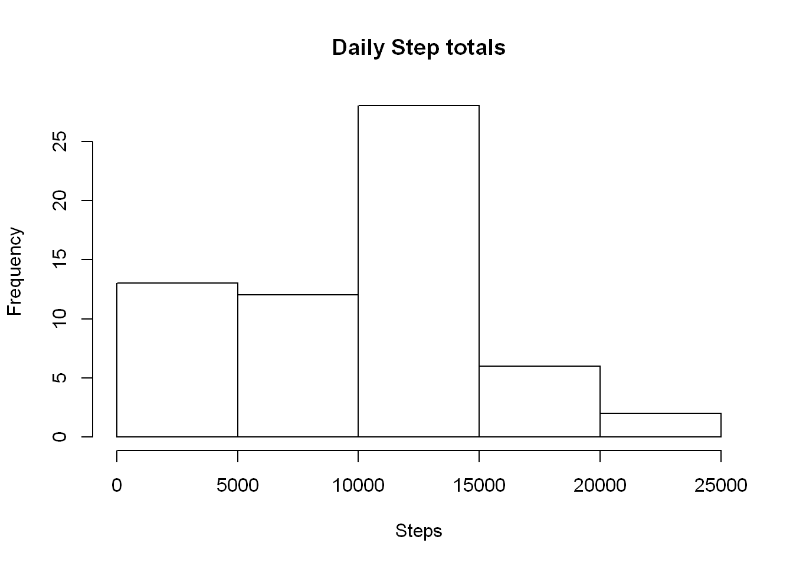
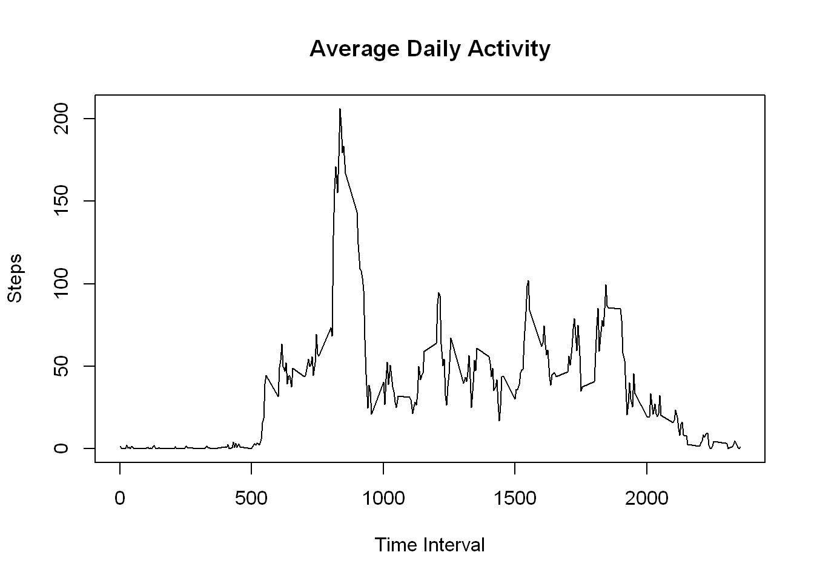
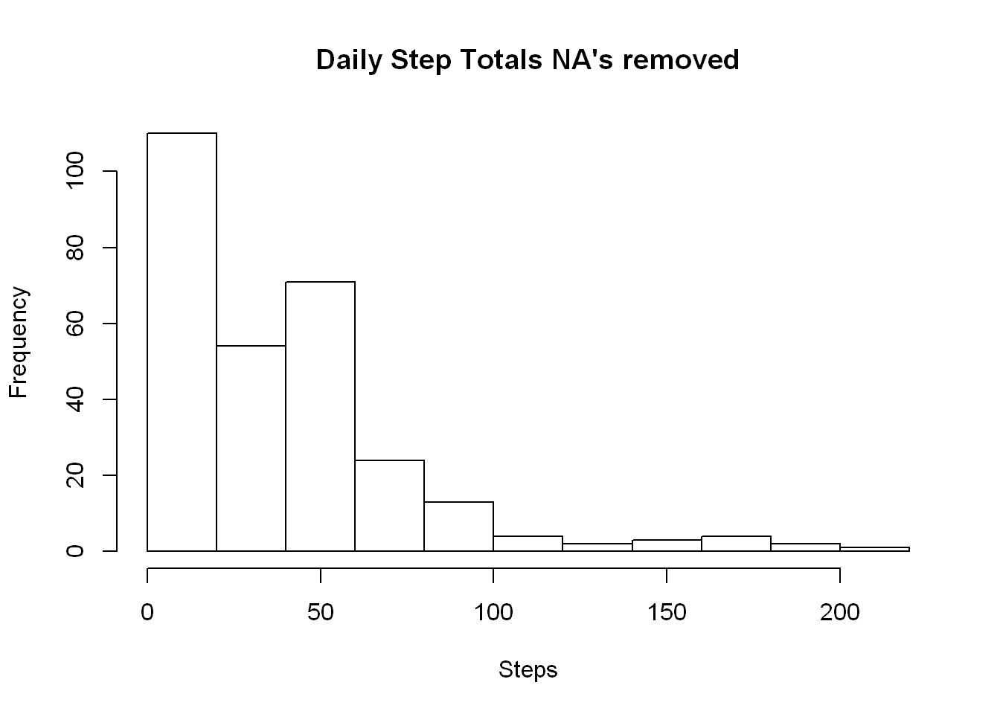
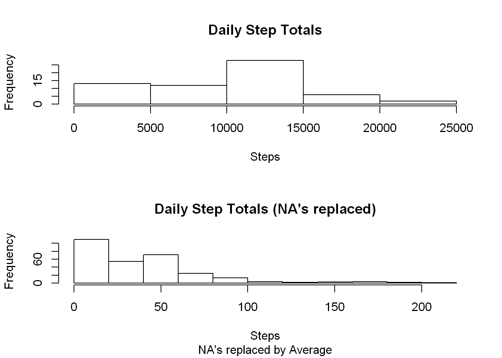
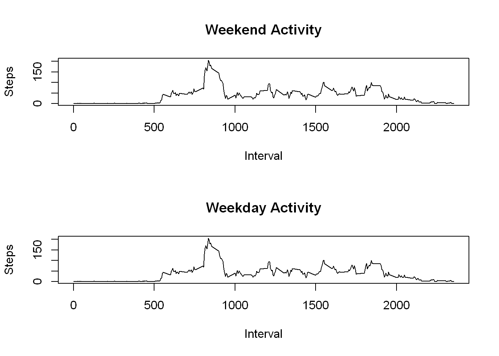

title: "Course Assignment 1"
author: "Sara Sofia"
date: "Thursday, January 21, 2016"
output: html_document
  keep_md: true
---

This document was created as a Course Assignment for the Reproducible Data Course through Johns Hopkins.  

The data that is presented is sourced from two months(October through November of 2012) of an anonymous individuals activity recorded at 5 minute intervals.  

##Loading and preprocessing the data


```r
if(!file.exists("./data")){dir.create("./data")}
fileUrl<- "http://d396qusza40orc.cloudfront.net/repdata%2Fdata%2Factivity.zip"
download.file(fileUrl, destfile="./data/activity.zip", mode="wb")
unzip(zipfile="./data/activity.zip", exdir="./data")
activity<-read.csv(file="./data/activity.csv", header=TRUE, sep=",")

summary(activity)
```

```
##      steps                date          interval     
##  Min.   :  0.00   2012-10-01:  288   Min.   :   0.0  
##  1st Qu.:  0.00   2012-10-02:  288   1st Qu.: 588.8  
##  Median :  0.00   2012-10-03:  288   Median :1177.5  
##  Mean   : 37.38   2012-10-04:  288   Mean   :1177.5  
##  3rd Qu.: 12.00   2012-10-05:  288   3rd Qu.:1766.2  
##  Max.   :806.00   2012-10-06:  288   Max.   :2355.0  
##  NA's   :2304     (Other)   :15840
```
What is mean total number of steps taken per day?

1. Calculate the total number of steps taken per day.

```r
dailytotal<-aggregate(list(Steps=activity$steps), by=list(Day=activity$date), FUN=sum, na.rm=TRUE)
summary(dailytotal)
```

```
##          Day         Steps      
##  2012-10-01: 1   Min.   :    0  
##  2012-10-02: 1   1st Qu.: 6778  
##  2012-10-03: 1   Median :10395  
##  2012-10-04: 1   Mean   : 9354  
##  2012-10-05: 1   3rd Qu.:12811  
##  2012-10-06: 1   Max.   :21194  
##  (Other)   :55
```


2. Create histogram of total daily steps

```r
hist(dailytotal$Steps, main="Daily Step totals", xlab="Steps")
```

\
3. Calculate and report the mean and median of the total number of steps taken per day

```r
mean(dailytotal$Steps)
```

```
## [1] 9354.23
```

```r
median(dailytotal$Steps)
```

```
## [1] 10395
```
To show the average daily activity pattern, I have created a a dataframe, timestep, which takes the mean for every five minute interval and plotted the data.

```r
timestep<-aggregate(list(Steps=activity$steps), by=list(Interval=activity$interval), FUN=mean, na.rm=TRUE)
```

```r
with(timestep, plot(Interval, Steps, type="l", xlab="Time Interval", ylab="Steps", main="Average Daily Activity"))
```

\
2 Which 5-minute interval, on average across all the days in the dataset, contains the maximum number of steps?

```r
subset(timestep, Steps== max(Steps))
```

```
##     Interval    Steps
## 104      835 206.1698
```
Imputing missing values
Calculate and report the total number of missing values in the dataset (i.e. the total number of rows with NAs)

```r
sum(is.na(activity$steps))
```

```
## [1] 2304
```

To see what the data would look like with the step NA's replaced, I am going to replace them with the value of the median step value for the appropriate interval.

```r
activity1<-activity
for (i in 1:17568) {
    if ((is.na(activity1$steps[i])==TRUE)&& (identical(activity1$interval[i], timestep$Interval[i])==TRUE)) {
        activity1$steps<-timestep$Steps
    }
}
```
3.Make a histogram of the total number of steps taken each day and

```r
total2<-aggregate(list(Steps=activity1$steps), by=list(Intervl=activity1$interval), FUN=mean)
hist(total2$Steps, main="Daily Step Totals NA's removed", xlab="Steps")
```

\
Calculate and report the mean and median total number of steps taken per day. 

```r
mean(total2$Steps)
```

```
## [1] 37.3826
```

```r
median(total2$Steps)
```

```
## [1] 34.11321
```
Do these values differ from the estimates from the first part of the assignment? 
Subtract original mean and median from new mean and meadian:

```r
mean(dailytotal$Steps)-mean(total2$Steps)
```

```
## [1] 9316.847
```

```r
median(dailytotal$Steps)-median(total2$Steps)
```

```
## [1] 10360.89
```
The original mean and median were much higher than the reformatted mean and median.


What is the impact of imputing missing data on the estimates of the total daily number of steps?

```r
par(mfrow=c(2,1))
hist(dailytotal$Steps, main="Daily Step Totals", xlab="Steps")
hist(total2$Steps, main="Daily Step Totals (NA's replaced)", sub="NA's replaced by Average", xlab="Steps")
```

\
The results show that the anonymous subject was actually less active than originally thought with many of the values not being reported.

Are there differences in activity patterns between weekdays and weekends?

```r
days<-activity1
days$date<-as.Date(as.character(days$date))
days$day<-weekdays(days$date)

for (i in 1:17568) {
  if ((days$day[i]=="Saturday")|(days$day[i]=="Sunday")){
      days$day[i]<-"weekend"
  }else{
      days$day[i]<-"weekday"
        }
    }
days1<-aggregate(list(Steps=days$steps), by=list(Interval=days$interval, Day=days$day), FUN=mean)
```
Plot the activities per interval of the weekend and weekday data frames.

```r
library(lattice)                                
xyplot(Steps~Interval |as.factor(Day), data=days1,type="l", layout=c(1,2))
```

\
